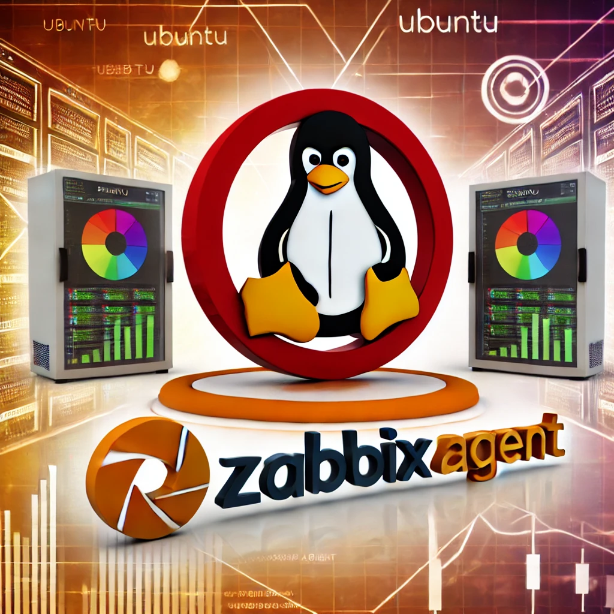

# zbx7-auto-reg

The independent work - Vagrant and Zabbix Agent2 7.0 LTS - Auto-registration to
[Zabbix pfSense](https://enceladus.pfsense.cz)

# Zabbix pfSense monitoring - Linux distribution by Agent2

Pomocí Vagrant si vytvořte server s libovolnou Linux distribucí. Instalujte
na nej  Zabbix Agent2 a upravte konfiguraci tak, aby se tento host
automaticky registroval na privátní - [Zabbix pfSense](https://enceladus.pfsense.cz).

## Požadované známkované úkoly

- Přihlašte se na Zabbix server Enceladus pod účtem spos a ověřte kolik hostů je monitorováno v tomto zabbixu.
- Vytvořte si adresář s konfigurací, která zajistí deploy Vámi zvolené Linuxové distribuce pomocí Vagrant.
- Vytvořte instalační a konfigurační scripty tak, aby jste nainstalovali Zabbix agent2 verze 7.0 LTS do VM a nastavili konfiguraci agenta pro auto-registraci na Zabbix server enceladus.pfsense.cz. Akce na Enceladu má nastavenu takovou podmínku (Host metadata contains SPOS)
- Výsledný Váš registrovaný host s unikátním jmenem vložte jako Screenshot do adresáře Images.
- Svého registrovaného hosta vyexportuje v libovolném formátu YAML, XML nebo JSON jako soubor a vložte do Vašeho projektu.
- Upravte README.md tak, aby obsohovalo informace o Vašich změnách v tomto zadání.

# Nápověda

- Zabbix 7.0 LTS [auto-registration](https://www.zabbix.com/documentation/7.0/en/manual/discovery/auto_registration)
- [Vagrant examples](https://github.com/sposdknl/2025-sposdk-osy/tree/main/Vagrant)

...
